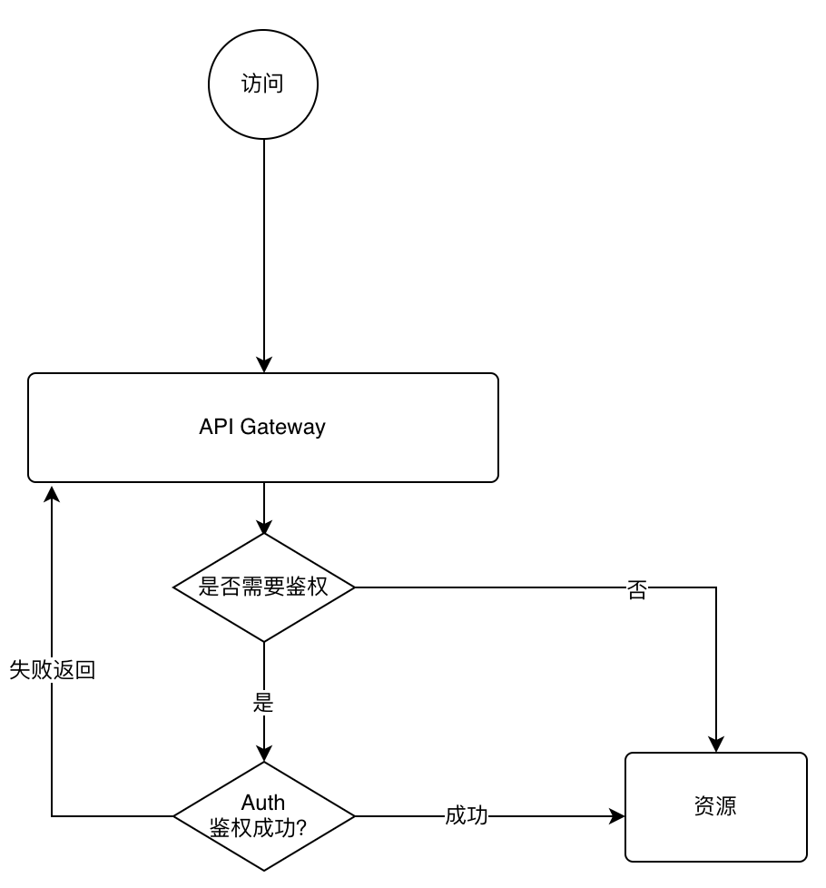

## spring-micro-service
这是一个springboot的微服务轻量脚手架。脚手架注册中心使用nacos，网关使用spring cloud gateway。接口完成统一返回、统一异常处理等。
登录、退出、权限校验的具体实现，只包含演示代码，大家需要根据自身项目情况调整。

## 包含
> * ms-rest-starter: springboot restfull接口基础配置，包括统一返回、统一异常处理、controller用户参数注入（部分实现，可根据实际调整AuthContext中内容）、
> * ms-gateway: API网关，包含访问统一转发，权限控制(过滤)，网关模块独立实现统一异常处理。
> * ms-auth: 用户认证，登录、退出、权限校验接口具体实现，
> * ms-test: 演示测试模块


## 流程图



## 版本依赖说明
### jdk说明
jdk1.8以上版本，本地为16

### nacos版本
```
 nacos/nacos-server:2.0.3
```
测试环境，使用的密码模式。大家可以根据自己需要调整各个配置文件中对应内容

### 父工程说明
```xml
    <parent>
        <groupId>org.springframework.boot</groupId>
        <artifactId>spring-boot-starter-parent</artifactId>
        <version>2.6.2</version>
    </parent>
```
整个工程，以springboot2.6.2为基础

### spring-cloud 版本和 spring-cloud-alibaba 版本
```xml
     <properties>
        <spring-cloud.version>2021.0.0</spring-cloud.version>
        <spring-cloud-alibaba.version>2.2.6.RELEASE</spring-cloud-alibaba.version>
     </properties>
```

## 使用测试
> 测试说明：在测试中，没有引进数据库相关内容。用户名和密码为：admin/123456

### 登录接口测试
```
POST http://127.0.0.1:5010/ms-auth/login

Content-Type: application/json

{
    "username": "admin",
    "password": "123456"
}
```

### User信息接口测试
```
GET http://127.0.0.1:5010/ms-auth/user/info

Header: authorization=TestToken

```
